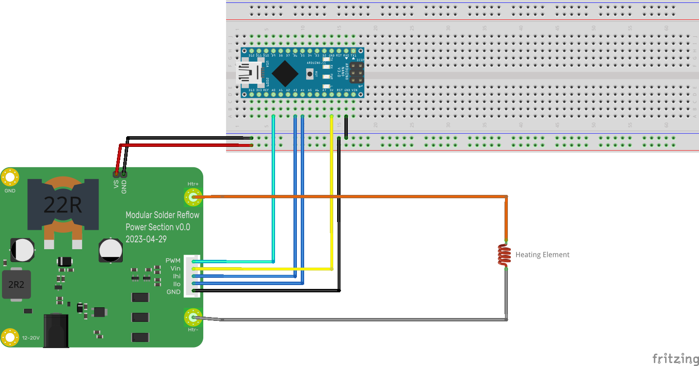

# Power Section Design

This directory contains a design for the main power control section of a reflow hotplate. The design is based on a buck converter with a low side switch. It includes current sensing via two INA180 current sense amplifiers. The PWM signal is provided externally. The main goals of the current design are:

  - Verify the design works.
  - Reduce current ripple and voltage spikes to manageable levels.
  - Allow high frequency operation without making input capacitors or other components excessively hot.
  - Allow testing of different microcontroller, screen and UI combinations with a working power section.
  - Provide up to 100W of output power.
  - Be able to operate from power supplies ranging from 12V to 20V DC.

## How to Use This Module

This module provides the power section of a hotplate only. It provides a means for efficient power conversion. It does not supply the control system (ie. microcontroller and firmware), the user interface (eg. screen and buttons or rotary encoder) or the load (ie. the heating element). You need to provide these. Further modules will become availableas the design progresses, although the modular nature also means that you can provide your own.

### Heat Considerations

While care has been taken to design a reasonably efficient design and use components rated for the required currents and they have been mounted with ample board space to help dissipate any heat, this module does handle reasonably large amounts of power. Some of that power will be dissipated in parts of the board and so it may get warm. The board is not yet tested, so you should take appropriate care when testing the board for your own needs and monitor the temperature of its components until you're satisfied that it can adequately handle the heat for your use case.

### Connections

The module includes the following connections:

|| Connector   | Pin  | Description |
| :--- | :---        | :--- | :---        |
|| Barrel Jack |      | Input power. 12V minimum. 18-20V preferred. Note that the Digikey part is rated for up to 8A. The LCSC part is rated for up to 7A. 5.5 x 2.5mm barrel connector. Centre pin positive.|
|| 12-20V      |      | Alternate connection for external power positive terminal via an M3 ring connector or similar. |
|| GND         |      | Alternate connection for external power negative terminal via an M3 ring connector or similar. Grounded. |
|| Htr+        |      | Positive connection for the heating element. |
|| Htr-        |      | Negative connection for the heating element. Note that this is not grounded and must not be connected to the ground connections of this board. |
|<td rowspan=5>J1</td>| PWM  | PWM signal. The gate driver is inverting, so the PWM signal must be active low. When the PWM signal is below about 0.8V, the main MOSFET switch will be on. When this voltage is above about 2.5V, the main MOSFET switch will be off. It does have a 10k pullup to _Vin_, so if left floating should ensure that the main MOSFET switch is off. |
|| Vin  | Supply voltage for the control board. This is used to power current sense and pullups for the gate drive input to ensure compatibility with the microcontroller. Must be between 3.0 and 5.5V. |
|| Ihi  | Current sense output for heating element current used for measuring high magnitude currents. Assuming a 15 $m\Omega$ shunt, voltage should be approximately $V_{Ilo} = 0.015 \times 20 \times I_{htr}$. Output is limited to approximately _Vin_. |
|| Ilo  | Current sense output for heating element current used for measuring low magnitude currents. Assuming a 15 $m\Omega$ shunt, voltage should be approximately $V_{Ilo} = 0.015 \times 200 \times I_{htr}$. Output is limited to approximately _Vin_. |
|| GND  | Ground connection for control board. |
|<td rowspan=5>J2</td>| VS   | Auxiliary connection for supplying power to external boards. This is not intended as an input pin and cannot safely supply the power requirements of the heating element. It is intended as an output to potentially feed power to other boards that may require it. For example, if you don't have some other power supply for your control board, you could feed this into a 3 terminal regulator to provide a steady 5V or 3.3V supply to your control board. |
|| GND  | Auxiliary ground connection for supplying power to external boards. The same power limitations and expected uses for _J2-VS_ also apply to this pin. |

A basic diagram of minimal connections to this module is shown below. A more typical setup would may also include additional items such as a screen, buttons/rotary encoder for input, voltage divider for measuring input voltage, thermistor or other temperature sensor connections and the like.

### Hotplates

The modular design of this board requires that you supply a separate hotplate. While this does mean that you have more separate pieces to connect and potential higher expense to have them produced, it does provide the following advantages:

  - Larger size/lower cost. If working with the cheap Chinese based board manufacturers like JLCPCB, PCBWay, Elecrow and the like, prices are extremely cheap if you can keep under 100mm x 100mm in size. With this pricing, you should be able to produce a board like this plus a 100mm x 100mm hotplate board more cheaply than you could have an integrated board with a hotplate this size included. The integrated board therefore either requires more money or must sacrifice hotplate size to stay cheap.
  - Replaceable hotplate. While it's still unclear just how durable PCB based hotplates may be, we do expect them to eventually wear out from the thermal cycling they will be put through. Having a separate hotplate PCB with minimal electronics attached makes them easier and cheaper to replace when they do wear out.
  - Thermal isolation. A separate hotplate PCB can be more easily and more effectively isolated from the rest of the system without the need to take up valuable board space with cut-outs or other design features to keep the heat of the hotplate away from control and user interface components.

The power module connects to the hotplate via two M3 ring connector terminals on the right side of the board. These can also be used as mounting holes for the board provided that they are being mounted into a non-conductive base. A suggested option is to use a 3D printed base of some sort in ABS or PLA. Care should be taken to ensure sufficient thermal isolation of the base from heat that may be produced in the power module and the hotplate. 

Cables connecting the power module and hotplate should be of sufficient weight to handle the currents involved. They should also use appropriate insulation to handle any thermal leakage from the hotplate into the wires. A minimum suggested spec would be 16AWG stranded copper wire with silicone insulation.

It is recommended to use mechanical connectors for the connections to your hotplate as well. M3 ring connectors are my preferred solution. These avoid problems with plastic or soldered connections which may melt from the heat of the hotplate. After all, the hotplate is intended to get hot enough to melt various solder alloys.

If you currently have spare boards from building a V2.4 or V3.0 board of the AfterEarthLtd hotplate design, you can use one of those as an external hotplate for this board if you have nothing better. You can connect wires directly to the heating element by soldering them onto the board. One should connect to the MOSFET drain terminal (the large one). The other should connect to lower terminal (ie. closest to the heating element) of either C7, D2 or both. If possible, use a higher temperature solder alloy for these connections such as SAC305 (the usual lead-free alloy of tin-silver-copper used in electronics). This should help prevent these connections from desoldering themselves during a reflow cycle.

### Controller

The current design does not yet include a controller. You will need to provide your own. In the absence of a more bespoke design, the suggestion is to use a typical prototyping board like one of the various Arduino modules, Seeeduino Xiao, STM32 Blue Pill, WEMOS S2 Mini or similar boards. My original work with this module will work with Arduino Nano, Seeeduino Xiao and Blue Pill boards. I have most experience with the Nano and the Xiao, although my long term goal is to use STM32 microcontrollers for controlling these hotplates. My plan is to make the firmware modular as well and easily ported to different microcontroller platforms, sensor suites and user interfaces. Until that is done, you are welcome to experiment with this board and with building your own firmware.

J1 should provide most of the connections you may require for the microcontroller to this power module. It is designed as a 5 pin JST-XH connector or compatible. Alternatively, you could also use a 0.1" pin header for connection if you already have those conveniently available. The _PWM_, _Vin_ and _GND_ pins must be connected. _Ihi_ and _Ilo_ can be used for sensing the heating element currents which can be used in conjunction with the heating element voltage to deduce heating element resistance and use it as a temperature sensor. If you also wish to monitor supply voltage, you can feed J2 to an off-board voltage divider to measure that as well. These connections should all be low current/power and should be possible to build on a solderless breadboard for prototyping purposes.

## Theory Of Operation

In addition to the main power input, this board expects a PWM signal at a frequency between 60kHz and 200kHz. The gate drive circuitry is inverting, so the PWM pin is active low. Users must bear this in mind when developing software to control this board. The PWM signal can operate on 3.3V or 5V. It is first fed into MOSFET Q1, which provides level shifting in conjunction with R5. This pulls the PWM signal up to near the main power supply voltage. This is one of the reasons for the 20V upper limit on the input voltage. Most MOSFETs are limited to about 20V on their gate.

The level shifted PWM signal is then fed into a totem pole gate driver (U4) to drive larger currents into Q2's gate. Q2 is the main MOSFET switch. When the PWM signal goes low, Q2's gate is driven high, turning it on. Once Q2 turns on, it pulls current through the heating element and L2. When the PWM signal goes high again, Q2's gate is pulled low, turning it off. Diode D3 now starts to conduct providing a conduction path for the current in L2. L2 limits current ripple in the heater circuit. Capacitor C9 reduces voltage ripple.

C8 and R10 form an RC snubber across the main MOSFET switch. Component values are approximate and not specifically tuned for this design yet. That said, it is expected that they should function adequately for the task. There is also an RC snubber across D3 formed by R8 and C7.

Resistors R11, R12 and R13 form a current shunt for measuring the current through the heating element. The three 45m$\Omega$ resistors form a 15m$\Omega$ shunt. These resistors should have a low temperature coefficient of resistance. Three 2W resistors are specified to provide ample headroom to dissipate heat when operating at high currents - as may be necessary for 12V supplies.

The design includes two current sense amplifiers with different gains to allow for full range current sensing while also allowing higher resolution at lower currents. The current sense amplifier outputs have a low pass filter on their outputs formed by R1/C3 and R2/C4. As designed, these have a corner frequency at about 1.6kHz. It is assumed that PID control would use a sample frequency somewhere in the vicinity of 20-50Hz,

The input currently includes a 10 amp fuse to protect against overcurrent faults. It also includes an input LC filter to help limit upstream impacts from the operation of the heater control.

## Optional Components

The RC snubbers formed by C8/R10 and C7/R8 are not entirely necessary for the ciruit to work, however, they should reduce ringing and other transient effects from the high frequency switching of large currents.

Diode D1 provides a lower impedance path for discharge Q2's gate at turn-off time. While this is usually desirable, the circuit will likely work ok without it.

If you have no intention of measuring the heater current, you can omit the INA180 current sense amplified and associated buffer and filter components. You do need to either include R11, R12 and R13 or alternatively short them with some wire suitable for the current you expect to drive with this board.

Inductor L1 may not ne necessary. It's main purpose is to reduce the amount of noise fed back to the upstream power supply, however, the board will likely work relatively fine without it. If not used, simply short the contacts for L2 with some wire.

## 3D Models

To render a 3D representation of the board and components, some of the footprints require 3D models that are not available with KiCad and are also not included in the git repository. There are freely available 3D models for these components, but since I'm not sure of the licensing of these models, I'm reluctant to include them and effectively be redistributing them in my git repository. Instead, I've included a shell script in the 3d subdirectory that will download the models from publicly accessible locations on the web for you to use for your own needs. If you don't care about a 3D rendering of the board and components, then you don't need these 3D models.

